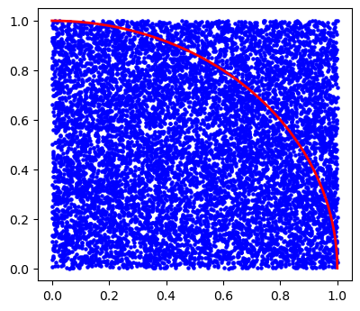
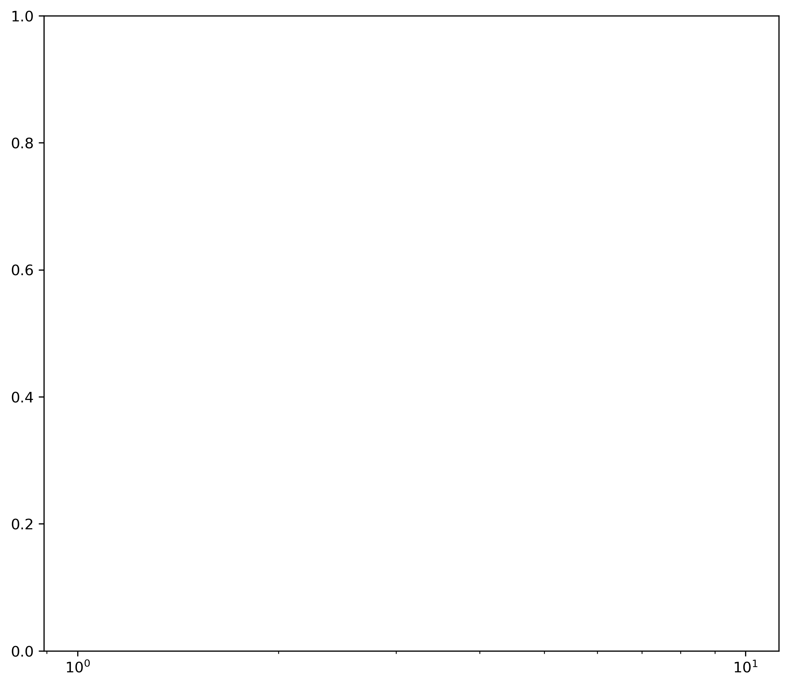
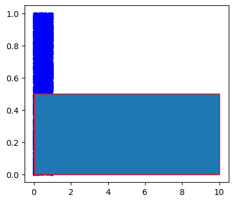
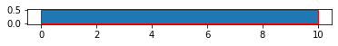

### Question 1


```python
import numpy as np
import numpy.random as rnd
import matplotlib.pyplot as plt

nsim = 10000 # number of darts or simulations

dart_crd = np.zeros((nsim,2))

circDartCounter = 0
for isim in range(nsim): 
    dart_crd[isim,:] = [ rnd.random() # x value
                        ,rnd.random() # y value
                       ]
    distanceSquared = dart_crd[isim,0]**2 + dart_crd[isim,1]**2
    if distanceSquared <= 1: circDartCounter+= 1
    
fig = plt.figure(figsize = (4.5,4), dpi = 100)
ax = fig.add_subplot(1,1,1)
ax.scatter ( dart_crd[:,0]
            , dart_crd[:,1]
            , s = 5
            , c = 'b'
           )

# draw cicle

nangle = 50
angles = np.linspace(0,np.pi/2,nangle)
circle = np.zeros((nangle,2))
circle[:,0] = np.cos(angles)
circle[:,1] = np.sin(angles)
ax.plot( circle[:,0]
        , circle[:,1]
        , c = "red"
        , linewidth = 2
       )
pi = 4 * circDartCounter / nsim
print("Apporximate value of pi = {}".format(pi))

fig = plt.figure( figsize=(9, 8) \
                , dpi= 300 \
                , facecolor='w' \
                , edgecolor='w' \
                ) # create figure object

ax = fig.add_subplot(1,1,1) # Get the axes instance
lineTypes = ['r-']
for i in range( nsim ) :
    ax.semilogx ( trial[:] \
                , dart_crd[:,i] \
                , lineTypes[i] \
                ) # plot with color red, as line
ax.set_xlabel('Number Of Sampled Pi')
ax.set_ylabel('Approximate Value of Pi')
ax.set_title('N={} throws of a virtual die in Python'.format(nTrial))
fig.savefig('PiEstimation.png', dpi=700) # save the figure to an external file
plt.tight_layout() # display the figure
plt.show() # display the figure

```

    Apporximate value of pi = 3.1536
    


    ---------------------------------------------------------------------------

    ValueError                                Traceback (most recent call last)

    <ipython-input-25-8a10b59b7405> in <module>
         47 lineTypes = ['r-']
         48 for i in range( nsim ) :
    ---> 49     ax.semilogx ( trial[:] \
         50                 , dart_crd[:,i] \
         51                 , lineTypes[i] \
    

    ~\anaconda3\lib\site-packages\matplotlib\axes\_axes.py in semilogx(self, *args, **kwargs)
       1915                       'basex', 'subsx', 'nonposx']}
       1916         self.set_xscale('log', **d)
    -> 1917         return self.plot(
       1918             *args, **{k: v for k, v in kwargs.items() if k not in d})
       1919 
    

    ~\anaconda3\lib\site-packages\matplotlib\axes\_axes.py in plot(self, scalex, scaley, data, *args, **kwargs)
       1741         """
       1742         kwargs = cbook.normalize_kwargs(kwargs, mlines.Line2D)
    -> 1743         lines = [*self._get_lines(*args, data=data, **kwargs)]
       1744         for line in lines:
       1745             self.add_line(line)
    

    ~\anaconda3\lib\site-packages\matplotlib\axes\_base.py in __call__(self, data, *args, **kwargs)
        271                 this += args[0],
        272                 args = args[1:]
    --> 273             yield from self._plot_args(this, kwargs)
        274 
        275     def get_next_color(self):
    

    ~\anaconda3\lib\site-packages\matplotlib\axes\_base.py in _plot_args(self, tup, kwargs)
        397 
        398         if x.shape[0] != y.shape[0]:
    --> 399             raise ValueError(f"x and y must have same first dimension, but "
        400                              f"have shapes {x.shape} and {y.shape}")
        401         if x.ndim > 2 or y.ndim > 2:
    

    ValueError: x and y must have same first dimension, but have shapes (100000,) and (10000,)


    

    


    

    


### Question 2


```python
import numpy as np
import numpy.random as rnd
import matplotlib.pyplot as plt

nsim = 10000 # number of darts or simulations

dart_crd = np.zeros((nsim,2))

circDartCounter = 0
for isim in range(nsim): 
    dart_crd[isim,:] = [ rnd.random() # x value
                        ,rnd.random() # y value
                       ]
    distanceSquared = dart_crd[isim,0]**2 + dart_crd[isim,1]**2
    if distanceSquared <= 1: circDartCounter+= 1
    
fig = plt.figure(figsize = (4.5,4), dpi = 100)
ax = fig.add_subplot(1,1,1)
ax.scatter ( dart_crd[:,0]
            , dart_crd[:,1]
            , s = 5
            , c = 'b'
           )
import matplotlib.pyplot as plt
plt.axes()
rectangle = plt.Rectangle((0,0), 10, .5,ec="red")
plt.gca().add_patch(rectangle)
plt.show()
```

    <ipython-input-60-47911d4f0906>:25: MatplotlibDeprecationWarning: Adding an axes using the same arguments as a previous axes currently reuses the earlier instance.  In a future version, a new instance will always be created and returned.  Meanwhile, this warning can be suppressed, and the future behavior ensured, by passing a unique label to each axes instance.
      plt.axes()
    


    

    


```python
import numpy as np
import numpy.random as rnd
import matplotlib.pyplot as plt

nsim = 10000 # number of darts or simulations

dart_crd = np.zeros((nsim,2))

circDartCounter = 0
for isim in range(nsim): 
    dart_crd[isim,:] = [ rnd.random() # x value
                        ,rnd.random() # y value
                       ]
    distanceSquared = dart_crd[isim,0]**2 + dart_crd[isim,1]**2
    if distanceSquared <= 1: circDartCounter+= 1
    
fig = plt.figure(figsize = (4.5,4), dpi = 100)
ax = fig.add_subplot(1,1,1)
ax.scatter ( dart_crd[:,0]
            , dart_crd[:,1]
            , s = 5
            , c = 'b'
           )

angles = np.linspace(0,2*np.pi,200)
import matplotlib.pyplot as plt
fig = plt.figure()
ax = plt.subplot(0,0)
#ax = plt.axes()
ax.plot ( np.
        , np.sin(angles)
        #, "r-"
         , "b-"
        )


```


      File "<ipython-input-58-9304b2a85b90>", line 31
        , np.sin(angles)
        ^
    SyntaxError: invalid syntax
    


```python
import matplotlib.pyplot as plt
plt.axes()
rectangle = plt.Rectangle((0,0), 10, .5,ec="red")
plt.gca().add_patch(rectangle)
plt.axis('scaled')
plt.show()
```


    

    


### Question 3


```python

```
