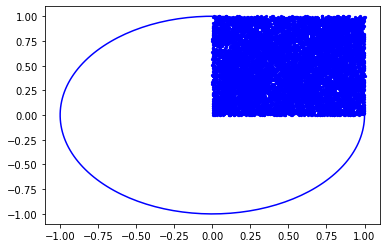
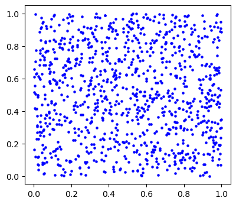

```python
import matplotlib.pyplot as plt
angles = np.linspace(0,2*np.pi,200)
fig = plt.figure()
ax = plt.subplot(1,1,1)
#ax  plt.axes()
ax.plot ( np.cos(angles)
        , np.sin(angles)
        #, "r-"
         , "b-"
        )
import numpy.random as rnd
nsim = 10000 # number of darts or simulations
dart_crd = np.zeros((nsim,2))
for isim in range(nsim): dart_crd[isim,:] = [rnd.random(),rnd.random()]


fig = plt.figure(figsize = (4.5,4), dpi = 100)
#ax = fig.add_subplot(1,1,1)
ax.scatter ( dart_crd[:,0]
            , dart_crd[:,1]
            , s = 5
            , c = 'b'
           )

```


    <matplotlib.collections.PathCollection at 0x14abb013d90>


    

    


    <Figure size 450x400 with 0 Axes>


```python
import numpy as np
import numpy.random as rnd
import matplotlib.pyplot as plt
nsim = 1000 # number of darts or simulations
dart_crd = np.zeros((nsim,2))
for isim in range(nsim): dart_crd[isim,:] = [rnd.random(),rnd.random()]


fig = plt.figure(figsize = (4.5,4), dpi = 100)
ax = fig.add_subplot(1,1,1)
ax.scatter ( dart_crd[:,0]
            , dart_crd[:,1]
            , s = 5
            , c = 'b'
           )


```


    <matplotlib.collections.PathCollection at 0x14abb116250>


    

    


```python

```


```python

```
